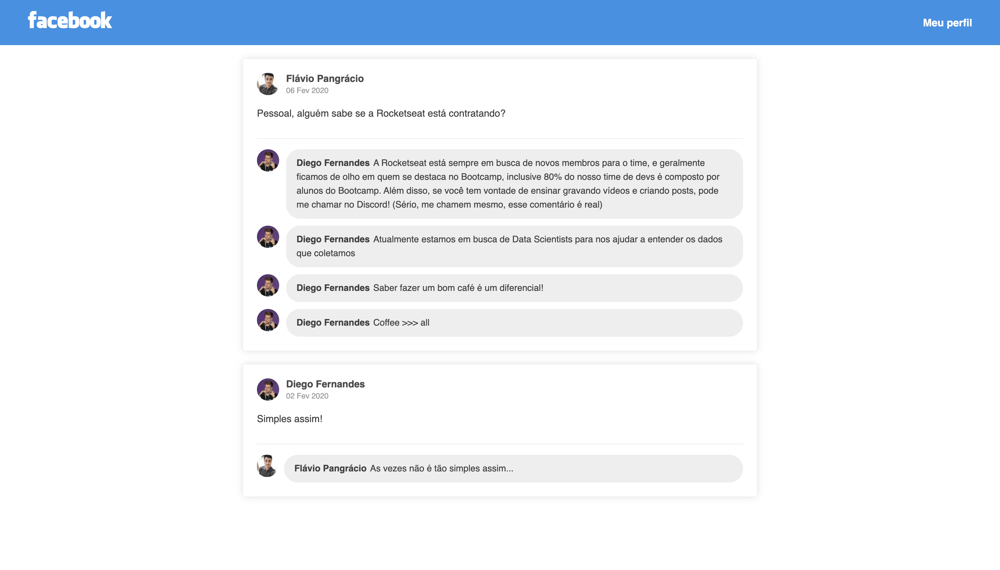

<h1 align="center">
    
</h1>

# Primeira aplicação ReactJS
Essa SPA, construída com ReactJS, é a solução de um desafio proposto pela [Rocketseat](https://www.rocketseat.com.br)  🚀.

---
### Para essa aplicação foram utilizadas as seguintes libs:
- [React](https://github.com/facebook/react)
- [ReactDOM](https://pt-br.reactjs.org/docs/react-dom.html)

### Para o desenvolvimento, também foram utilizados:
- [Babel](https://github.com/babel/babel)
- [Webpack](https://github.com/webpack)
---

---
[Página do desafio](https://github.com/Rocketseat/bootcamp-gostack-desafio-04)